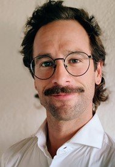

+++
title = "Engagiert für Alle "
date = "2024-02-24"
draft = false
pinned = true
tags = ["PluSport"]
image = "planzer_reto.jpg"
description = "Laufsport zählt zu den beliebtesten Sportarten in der Schweiz. An Laufsportveranstaltung können Alle zusammenlaufen und das ist das Schöne."
+++


Laufsport zählt zu den beliebtesten Sportarten in der Schweiz. An Laufsportveranstaltung können Alle zusammenlaufen und das ist das Schöne.



Nea Hofer und Luana Rentschler

PluSport wurde gegründet, um in der Schweiz Sportangebote und Sportleistungen für Menschen mit einer Beeinträchtigung anzubieten. Sport ist ein guter Treiber für Inklusion. Zusammen Sport treiben macht Spass und man kann sich begegnen. Über den Sport kann die Gesellschaft sensibilisiert werden, für mehr Toleranz für Menschen die anders sind.

#### Welche Arbeiten übernimmst du bei PluSport?

Diese sind aktuell sehr vielfältig. Im Moment betreue ich vor allem die Kooperationen mit Sportverbänden. Ich bin auch in regelmässigem Kontakt mit der Fachstelle Inklusion von Swiss Olympics. Daneben organisiere ich Aus- und Weiterbildungskurse für PluSport und leite diese auch. Unter anderem habe ich die Leitung für das Projekt «never Walk alone» oder für «PluSport@School», das sind Dienstleistungen die wir für die Schulen anbieten. 

#### Was waren die Hauptziele bei der Gründung und wie haben diese sich mit der Zeit verändert?
PluSport wurde 1960 gegründet, um in der Schweiz Sportangebote und Sportleistungen für Menschen mit einer Beeinträchtigung anzubieten. Dies gehört noch heute zum Kerngeschäft. PluSport unterscheidet sich insofern von anderen Organisationen wie, der schweizerischen Paraplegien Versicherung oder Rollstuhlsport Schweiz, dass viele Menschen mit unterschiedlichen Beeinträchtigungen Unterstützung bekommen. Bei uns treiben Rollstuhlfahrende Sport, Leute mit Amputationen, mit einer Geistigen Beeinträchtigung oder mit Autismus. Für diese organisieren wir Sportangebote. In den letzten Jahren sind mehr Dienstleistungen dazu gekommen, beispielsweise das Projekt «never Walk alone».

#### Wie unterstützt PluSport seine Sportler*innen? Wie versucht PluSport die beeinträchtigten Sportler**inne zu inkludieren?
Die Sportlerinnen sind bei uns Mitglied und können vergünstigt an Sportcamps teilnehmen. Unter anderem gibt es einen Prothesen Fond. Dieser Fond unterstützt Menschen finanziell die eine spezielle Beinprothesen benötigen. Eine Beinprothese kosten in der Regel ungefähr so viel wie ein Kleinwagen, zwischen 15'000 und 20'000 Franken.
Dann arbeiten wir mit dem Schweizerischen Dachverband, zusammen und versuchen die Verbandsführung zu überzeugen, dass es gesellschaftlich wichtig ist und Mehrwert bringt, Menschen mit einer Beeinträchtigung im Verband aufzunehmen. 
Auf der anderen Seite werden wir von Eltern angefragt, die ein Kind mit einer Beeinträchtigung haben, welches gerne Sport treiben möchte. Diese Familien unterstützen wir dabei die bestmögliche Lösung zu finden damit das Kind Sport treiben kann. Der Versuch diese Sportlerinnen zu inkludieren ist ein längerer Prozess und mit Aufwand verbunden.

#### PluSport ist der Meinung damit Inklusion tatsächlich gelebt werden kann, gibt es noch einiges zu tun, wie siehst du das und was gibt es noch zu tun?

Ich bin mit meiner Erfahrung so weit, dass ich sage, klar gibt es noch viel zu tun. Die Schweiz ist noch nicht so weit wie andere Länder. Jedoch wurde aber auch schon viel getan. Ein Grund ist, dass wir keine Kriegsvergangenheit haben, wie zum Beispiel England oder Deutschland. In der Schweiz hat die Inklusion erst später angefangen und deswegen muss man auch etwas Geduld mitbringen.

#### Es gibt das Laufprojekt «never Walk alone», was genau ist die Idee davon und wieso gestaltet sich gerade so ein Anlass attraktiv für Beeinträchtigte Sportler*innen? 
Laufsport zählt zu den beliebtesten Sportarten in der Schweiz. An dieser Veranstaltung können Alle zusammenlaufen, mit oder ohne Beeinträchtigung und das ist das Schöne. 

#### Welche Herausforderungen gibt es?
Die Herausforderung ist, genug Geld zu bekommen. PluSport ist ungefähr zu 30 Prozent durch Spenden finanziert. Wir sind auch eine Mitgliederorganisation. Dann gibt es noch das Fundraising, das macht für uns eine spezialisierte Firma. Des Weiteren ist jemanden angestellt, der sich um die Mittelbeschaffung kümmert. Es werden Projekteingaben bei Stiftungen gemacht, um Geldbeträge zu erhalten. Dafür muss man Ziele definieren und das Projekt muss zweckmässig sein. 

#### Wie plant PluSport sich weiterzuentwickeln?
PluSport ist bestrebt, noch stärker mit dem Sportsystem zusammenzuarbeiten. PluSport wird wahrscheinlich immer eine sogenannte Daseinsberechtigung haben, da es mit viel Aufwand verbunden ist stark beeinträchtigte Menschen zu inkludieren. Beispielsweise für ein*e Tetraplegiker*in im Elektrorollstuhl braucht es Separative Angebote, so können diese untereinander Sport treiben. 
Dann gibt es Angebote für Menschen, die weniger stark beeinträchtigt sind und sich gut in Regelsportvereine inkludieren lassen. Hier versucht PluSport sich zurückzunehmen. Die Entwicklung sollte dahin gehen das Regelsportverbände von sich aus, Angebote für Men-schen mit Beeinträchtigung anbieten. PluSport hat dann nur noch eine Beratungsfunktion und will nicht Alles an kicken. Das ist die längerfristige Entwicklung in einer inklusiven Gesell-schaft, die es anzustreben gilt. Sport ist ein guter Treiber für Inklusion. Zusammen Sport treiben macht Spass und man kann sich begegnen. Egal ob mit oder ohne Beeinträchtigung, einer anderen Kultur angehörig oder eine andere Sprache sprechend. Im Sport ist die Spra-che oft keine Barriere, während sie im Beruf vielleicht eine ist. Der Fussball ist ein bewährtes Beispiel. Der Fussball verbindet, deswegen kann über den Sport die Gesellschaft sensibilisiert werden. Für mehr Toleranz für Menschen, die anders sind, andere Voraussetzungen haben.